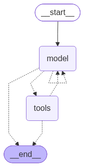

# Company Helper

An internal AI assistant for **AcmeTech** — answers employee questions about company policies, processes, and internal documentation using a RAG (Retrieval-Augmented Generation) pipeline.

## 🎥 Demo

[Demo](https://youtu.be/CXzaRAaGI-U)

---

## Overview

Company Helper lets employees chat with an AI agent that has access to AcmeTech's internal knowledge base. The agent decides which tool to call based on the question — semantic document search, full policy retrieval, leave-days lookup, or document summarization.

### Architecture



### Agent Tools

| Tool | When it's used |
|---|---|
| `search_docs` | Default — factual questions about the company, processes, onboarding, etc. |
| `policy_search_tool` | User asks for a specific policy document by name |
| `days_off_left_counter_tool` | User asks about remaining vacation days for a person |
| `summarize_document` | User explicitly asks to summarize/TL;DR a document |

---

## Tech Stack

- **LLM:** OpenAI `gpt-4o-mini`
- **Agent framework:** LangChain / LangGraph
- **Vector store:** ChromaDB
- **Embeddings:** `sentence-transformers/all-MiniLM-L6-v2`
- **API:** FastAPI + Uvicorn
- **Observability:** LangSmith tracing
- **Package manager:** [uv](https://docs.astral.sh/uv/)

---

## Setup

### Prerequisites

- Python 3.13+
- [uv](https://docs.astral.sh/uv/) installed
- An OpenAI API key

### Installation

```bash
uv sync
```

### Environment variables

Copy `.env.example` to `.env` and fill in your values:

```bash
cp .env.example .env
```

Required variables:

```env
OPENAI_API_KEY=sk-...

# Optional — LangSmith tracing
LANGSMITH_TRACING=true
LANGSMITH_API_KEY=...
LANGSMITH_ENDPOINT=https://api.smith.langchain.com
LANGSMITH_PROJECT=company-helper
```

### Ingest documents

Place your Markdown documents in `data/raw/` and run:

```bash
uv run ingest
```

This chunks the documents and stores embeddings in the local ChromaDB at `./chromadb`.

---

## Running the API

```bash
uv run api
```

The server starts at `http://127.0.0.1:8000`.

---

## API Endpoints

### `GET /`

Health check.

**Response**
```json
{ "Hello": "World" }
```

---

### `POST /chat`

Send a question to the AI assistant. Conversations are stateful per `thread_id` — the agent remembers previous messages within the same thread.

**Query params**

| Param | Type | Required | Description |
|---|---|---|---|
| `thread_id` | `int` | ✅ | Conversation thread identifier |

**Request body**

```json
{
  "question": "How many vacation days do I have left?"
}
```

**Response**

```json
{
  "answer": "You have 12 vacation days remaining in 2026.",
  "sources": ["data/raw/vacation-and-remote.md"],
  "used_tools": ["days_off_left_counter_tool"]
}
```

| Field | Type | Description |
|---|---|---|
| `answer` | `string` | The assistant's response |
| `sources` | `string[]` | Source documents used to produce the answer |
| `used_tools` | `string[]` | Agent tools that were called |

---

## Other CLI Commands

| Command | Description |
|---|---|
| `uv run ingest` | Ingest raw documents into ChromaDB |
| `uv run api` | Start the FastAPI server |
| `uv run rag-demo` | Run a local CLI demo of the RAG pipeline |
| `uv run eval` | Run the evaluation suite against the eval dataset |
